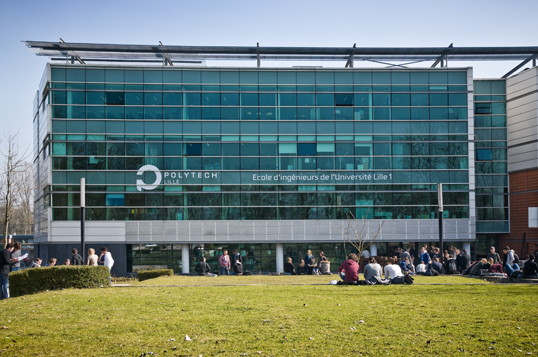
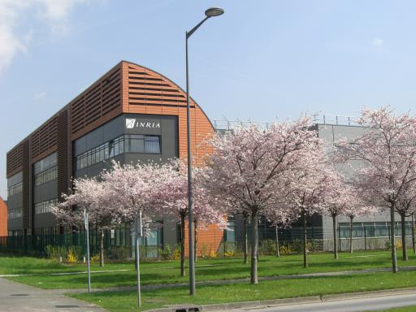

# Stale content report

Generated 2026-09-11 from `~/git/archive/jekyll-src/src/` at tag `jekyll-final`.

**Report only — do not fix (CLAUDE.md rule 6).** The author edits these by hand.
The site predates a move from Lille to Rennes and a promotion to Full Professor.

## Author's rulings (2026-09-11)

| Where | Ruling | Done |
|---|---|---|
| `index.html` (home) | Employer/profile text is stale. **Author writes a new profile later.** Ported as-is meanwhile. | postponed |
| `_includes/*.md` (research, teaching, contact) | Lille-era pages (University of Lille, Polytech, Spirals). Author moved to **University of Rennes / IRISA / Inria Rennes / ESIR in September 2022**. Kept as historical content. | stamped `archived: lille`; the template shows a notice |
| `google+`, `brandyourself` (footer, home) | Drop and remove. | removed in the footer port and by `move-content.sh` |

`_includes/contact.md` carries the old e-mail addresses and job title. It has the
archived notice like the rest, but it is a *contact* page — it wants the same
rewrite as the profile, not archiving. Flagged, not fixed.

Vendor directories excluded. Line numbers are against the Jekyll source, not the
built output.

**55 distinct lines across 12 files.** The per-term counts below sum to more than
that: many lines match several terms at once (e.g. "Polytech Lille" counts under
both `Lille` and `Polytech`).

## `Lille` — 34 occurrence(s)

```
_includes/dynamic-apps-cloud-computing.md:6:[Walter Rudametkin](mailto:Walter.Rudametkin@polytech-lille.fr) (Maître de conférences - Spirals)
_includes/dynamic-apps-cloud-computing.md:8:[Lionel Seinturier](mailto:Lionel.Seinturier@univ-lille1.fr) (Professeur - Spirals)
_includes/dynamic-apps-cloud-computing.md:13:Inria Lille - Nord Europe
_includes/teaching-gbiaal-moodle.md:3:Bonjour étudiants de Polytech Lille en Biologie et Agro Alimentaire !!!
_includes/teaching-gbiaal-moodle.md:9:<!--[https://moodle.polytech-lille.fr/course/view.php?id=97](https://moodle.polytech-lille.fr/course/view.php?id=97)-->
_includes/teaching-ima3-pa.md:3:Bonjour étudiants de Polytech Lille Informatique et Microélectronique Automatique
_includes/cloud-dynamic-monitoring-and-repair.md:23:[Martin Monperrus](mailto:Martin.Monperrus@univ-lille1.fr) (Associate Professor)
_includes/cloud-dynamic-monitoring-and-repair.md:25:[Walter Rudametkin](mailto:Walter.Rudametkin@polytech-lille.fr) (Associate Professor)
_includes/cloud-dynamic-monitoring-and-repair.md:27:[Romain Rouvoy](mailto:Romain.Rouvoy@univ-lille1.fr) (Associate Professor - HDR)
_includes/cloud-dynamic-monitoring-and-repair.md:32:Inria Lille - Nord Europe
_includes/teaching-git.md:3:Bonjour étudiants de Polytech Lille, GIS et IMA.
index.html:103:                                <a href="http://www.univ-lille1.fr"    itemprop="url" style="color: #FFFFFF"> <span itemprop="name">University of
index.html:107:                                <a href="http://www.polytech-lille.fr" itemprop="url" style="color: #FFFFFF"> <span itemprop="name">Polytech Lill
index.html:111:                        <!--<span itemprop="affiliation">Polytech Lille</span></h3>-->
index.html:151:                        <a href="http://www.polytech-lille.fr" itemprop="url"> <span itemprop="name">Polytech Lille</span></a>,
index.html:155:                        <a href="http://www.univ-lille1.fr" itemprop="url"> <span itemprop="name">University of Lille</span></a>.
index.html:168:                        Spirals is a joint team between the <a href="http://www.inria.fr">Inria</a> and the <a href="http://www.univ-lille.fr">Un
index.html:195:                    <a href="img/polytech-lille.jpg">
index.html:196:                        
index.html:199:                    <a href="img/inria-lille.jpg">
index.html:200:                        
_includes/contact.md:13:                    <span itemprop="jobTitle">Associate Professor</span> &mdash; <span itemprop="affiliation">University of Lille</span>
_includes/contact.md:19:                    <span itemprop="email"><a href="mailto:walter.rudametkin@univ-lille.fr">walter.rudametkin@univ-lille.fr</a></span>
_includes/contact.md:23:                    <span itemprop="email"><a href="mailto:walter.rudametkin@univ-lille.fr">walter.rudametkin@polytech-lille.fr</a></spa
_includes/contact.md:27:                    <span itemprop="affiliation">Teaching unit: Polytech Lille</span>
_includes/contact.md:38:                                <a href="https://www.inria.fr/centre/lille"><span itemprop="name">Inria Lille – Nord Europe</span></a><b
_includes/contact.md:60:                            <strong>Work Email&nbsp;&nbsp;</strong> <a href="mailto:walter.rudametkin@univ&#8209;lille1.fr" itemprop="em
_includes/contact.md:66:                Please use <span itemprop="email"><a href="mailto:walter.rudametkin@polytech-lille.fr">walter.rudametkin@polytech-lille.
_includes/dynamic-application-consistency.md:18:[Walter Rudametkin](mailto:Walter.Rudametkin@polytech-lille.fr) (Maître de conférences - Spirals)
_includes/dynamic-application-consistency.md:20:[Lionel Seinturier](mailto:Lionel.Seinturier@univ-lille1.fr) (Professeur - Spirals)
_includes/dynamic-application-consistency.md:25:Inria Lille - Nord Europe
_includes/optimisation-applications-cloud.md:6:[Walter Rudametkin](mailto:Walter.Rudametkin@polytech-lille.fr) (Maître de conférences - Spirals)
_includes/optimisation-applications-cloud.md:8:[Lionel Seinturier](mailto:Lionel.Seinturier@univ-lille1.fr) (Professeur - Spirals)
_includes/optimisation-applications-cloud.md:13:Inria Lille - Nord Europe
```

## `Polytech` — 19 occurrence(s)

```
_includes/dynamic-apps-cloud-computing.md:6:[Walter Rudametkin](mailto:Walter.Rudametkin@polytech-lille.fr) (Maître de conférences - Spirals)
index.html:107:                                <a href="http://www.polytech-lille.fr" itemprop="url" style="color: #FFFFFF"> <span itemprop="name">Polytech Lill
index.html:111:                        <!--<span itemprop="affiliation">Polytech Lille</span></h3>-->
index.html:151:                        <a href="http://www.polytech-lille.fr" itemprop="url"> <span itemprop="name">Polytech Lille</span></a>,
index.html:157:                        At Polytech I currently teach object oriented programming, software architecture and introduction to databases.
index.html:195:                    <a href="img/polytech-lille.jpg">
index.html:196:                        
index.html:372:                    <!--                         2007 Engineering degree in Informatics and Applied Math (equivalent to Master's), Institut Polyt
_includes/optimisation-applications-cloud.md:6:[Walter Rudametkin](mailto:Walter.Rudametkin@polytech-lille.fr) (Maître de conférences - Spirals)
_includes/dynamic-application-consistency.md:18:[Walter Rudametkin](mailto:Walter.Rudametkin@polytech-lille.fr) (Maître de conférences - Spirals)
_includes/contact.md:23:                    <span itemprop="email"><a href="mailto:walter.rudametkin@univ-lille.fr">walter.rudametkin@polytech-lille.fr</a></spa
_includes/contact.md:27:                    <span itemprop="affiliation">Teaching unit: Polytech Lille</span>
_includes/contact.md:65:                <h4>Students please note: my office at Polytech is F011.<br />
_includes/contact.md:66:                Please use <span itemprop="email"><a href="mailto:walter.rudametkin@polytech-lille.fr">walter.rudametkin@polytech-lille.
_includes/teaching-gbiaal-moodle.md:3:Bonjour étudiants de Polytech Lille en Biologie et Agro Alimentaire !!!
_includes/teaching-gbiaal-moodle.md:9:<!--[https://moodle.polytech-lille.fr/course/view.php?id=97](https://moodle.polytech-lille.fr/course/view.php?id=97)-->
_includes/cloud-dynamic-monitoring-and-repair.md:25:[Walter Rudametkin](mailto:Walter.Rudametkin@polytech-lille.fr) (Associate Professor)
_includes/teaching-git.md:3:Bonjour étudiants de Polytech Lille, GIS et IMA.
_includes/teaching-ima3-pa.md:3:Bonjour étudiants de Polytech Lille Informatique et Microélectronique Automatique
```

## `Spirals` — 13 occurrence(s)

```
index.html:164:                        <a href="https://team.inria.fr/spirals/" itemprop="url"> <span itemprop="name">Spirals project-team</span></a>.
index.html:168:                        Spirals is a joint team between the <a href="http://www.inria.fr">Inria</a> and the <a href="http://www.univ-lille.fr">Un
_includes/dynamic-apps-cloud-computing.md:6:[Walter Rudametkin](mailto:Walter.Rudametkin@polytech-lille.fr) (Maître de conférences - Spirals)
_includes/dynamic-apps-cloud-computing.md:8:[Lionel Seinturier](mailto:Lionel.Seinturier@univ-lille1.fr) (Professeur - Spirals)
_includes/dynamic-apps-cloud-computing.md:11:[Spirals Research Group](https://team.inria.fr/spirals/)
_includes/optimisation-applications-cloud.md:6:[Walter Rudametkin](mailto:Walter.Rudametkin@polytech-lille.fr) (Maître de conférences - Spirals)
_includes/optimisation-applications-cloud.md:8:[Lionel Seinturier](mailto:Lionel.Seinturier@univ-lille1.fr) (Professeur - Spirals)
_includes/optimisation-applications-cloud.md:11:[Spirals Research Group](https://team.inria.fr/spirals/)
_includes/cloud-dynamic-monitoring-and-repair.md:30:[Spirals Research Group](https://team.inria.fr/spirals/)
_includes/contact.md:40:                                <a href="https://team.inria.fr/spirals/"><span itemprop="name">Spirals project-team</span></a> <br />
_includes/dynamic-application-consistency.md:18:[Walter Rudametkin](mailto:Walter.Rudametkin@polytech-lille.fr) (Maître de conférences - Spirals)
_includes/dynamic-application-consistency.md:20:[Lionel Seinturier](mailto:Lionel.Seinturier@univ-lille1.fr) (Professeur - Spirals)
_includes/dynamic-application-consistency.md:23:[Spirals Research Group](https://team.inria.fr/spirals/)
```

## `CRIStAL` — 1 occurrence(s)

```
index.html:168:                        Spirals is a joint team between the <a href="http://www.inria.fr">Inria</a> and the <a href="http://www.univ-lille.fr">Un
```

## `Associate Professor` — 6 occurrence(s)

```
index.html:101:                        <h3><span itemprop="jobTitle">Associate Professor</span> @
index.html:149:                        Since September 2014 I'm an <span itemprop="jobTitle">associate professor </span> at
_includes/cloud-dynamic-monitoring-and-repair.md:23:[Martin Monperrus](mailto:Martin.Monperrus@univ-lille1.fr) (Associate Professor)
_includes/cloud-dynamic-monitoring-and-repair.md:25:[Walter Rudametkin](mailto:Walter.Rudametkin@polytech-lille.fr) (Associate Professor)
_includes/cloud-dynamic-monitoring-and-repair.md:27:[Romain Rouvoy](mailto:Romain.Rouvoy@univ-lille1.fr) (Associate Professor - HDR)
_includes/contact.md:13:                    <span itemprop="jobTitle">Associate Professor</span> &mdash; <span itemprop="affiliation">University of Lille</span>
```

## `google+` — 4 occurrence(s)

```
_includes/footer.html:17:                            class="fa fa-google-plus-square fa-fw"></i> <span class="network-name">google+</span></a></li>
index.html:121:                                    class="fa fa-google-plus-square fa-fw"></i> <span class="network-name">google+</span></a></li>
photos/2013.12.13_Dad_fishing_trip/index.html:125:                            class="fa fa-google-plus-square fa-fw"></i> <span class="network-name">google+</sp
photos/2014.01.16_Dad_keeps_torturing_me_with_these_pictures/index.html:125:                            class="fa fa-google-plus-square fa-fw"></i> <span class=
```

## `brandyourself` — 6 occurrence(s)

```
_includes/footer.html:18:                    <li><a href="http://walterrudametkin.brandyourself.com/" class="btn btn-default btn-lg"><i
_includes/footer.html:19:                            class="fa fa-share-square fa-fw"></i> <span class="network-name">brandyourself</span></a></li>
photos/2013.12.13_Dad_fishing_trip/index.html:126:                    <li><a href="http://walterrudametkin.brandyourself.com/" class="btn btn-default btn-lg"><i
photos/2013.12.13_Dad_fishing_trip/index.html:127:                            class="fa fa-share-square fa-fw"></i> <span class="network-name">brandyourself</sp
photos/2014.01.16_Dad_keeps_torturing_me_with_these_pictures/index.html:126:                    <li><a href="http://walterrudametkin.brandyourself.com/" class="
photos/2014.01.16_Dad_keeps_torturing_me_with_these_pictures/index.html:127:                            class="fa fa-share-square fa-fw"></i> <span class="netwo
```

## `univ-lille1` — 7 occurrence(s)

```
_includes/dynamic-apps-cloud-computing.md:8:[Lionel Seinturier](mailto:Lionel.Seinturier@univ-lille1.fr) (Professeur - Spirals)
index.html:103:                                <a href="http://www.univ-lille1.fr"    itemprop="url" style="color: #FFFFFF"> <span itemprop="name">University of
index.html:155:                        <a href="http://www.univ-lille1.fr" itemprop="url"> <span itemprop="name">University of Lille</span></a>.
_includes/cloud-dynamic-monitoring-and-repair.md:23:[Martin Monperrus](mailto:Martin.Monperrus@univ-lille1.fr) (Associate Professor)
_includes/cloud-dynamic-monitoring-and-repair.md:27:[Romain Rouvoy](mailto:Romain.Rouvoy@univ-lille1.fr) (Associate Professor - HDR)
_includes/dynamic-application-consistency.md:20:[Lionel Seinturier](mailto:Lionel.Seinturier@univ-lille1.fr) (Professeur - Spirals)
_includes/optimisation-applications-cloud.md:8:[Lionel Seinturier](mailto:Lionel.Seinturier@univ-lille1.fr) (Professeur - Spirals)
```

## `Inria Lille` — 6 occurrence(s)

```
index.html:200:                        
_includes/dynamic-apps-cloud-computing.md:13:Inria Lille - Nord Europe
_includes/optimisation-applications-cloud.md:13:Inria Lille - Nord Europe
_includes/cloud-dynamic-monitoring-and-repair.md:32:Inria Lille - Nord Europe
_includes/dynamic-application-consistency.md:25:Inria Lille - Nord Europe
_includes/contact.md:38:                                <a href="https://www.inria.fr/centre/lille"><span itemprop="name">Inria Lille – Nord Europe</span></a><b
```

